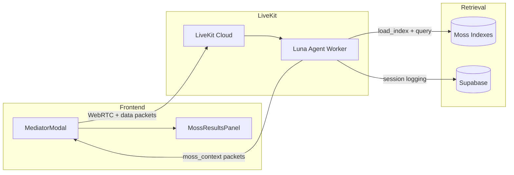

# LiveKit + Moss Migration Plan

> Replace VAPI voice infrastructure with LiveKit Agents + Moss for sub-10ms semantic retrieval.

**Status:** Hack in progress (Phase 1)  
**Reference:** [moss-hacker-starter](https://github.com/livekit-examples/moss-hacker-starter)  
**Docs:** [Moss LiveKit](https://docs.moss.dev/docs/build/voice-agent-livekit.md) · [LiveKit Docs MCP](https://docs.livekit.io/reference/developer-tools/docs-mcp/) · [Moss MCP](https://docs.moss.dev/docs/integrations/mcp-server)

---

## Goal

Reverse the VAPI migration and restore LiveKit as the sole voice transport, with **Moss** replacing Pinecone for hot-path retrieval during voice sessions.

```
Before (current prod):  Frontend → VAPI SDK → VAPI Cloud → /api/vapi webhooks → Pinecone
After (target):         Frontend → livekit-client → LiveKit Cloud → Luna Agent → Moss (in-process)
```

Moss gives ~1–10ms local queries after `load_index()`, vs network round-trips to Pinecone + Voyage on every turn.

---

## MCP Setup (for development)

These MCP servers help Cursor/agents build against current docs. They are **dev tools**, not runtime dependencies.

### LiveKit Docs MCP

Add to `.cursor/mcp.json`:

```json
{
  "mcpServers": {
    "livekit-docs": {
      "url": "https://docs.livekit.io/mcp"
    }
  }
}
```

Tools: `get_docs_overview`, `get_pages`, `docs_search`, `code_search`, `get_changelog`.

### Moss MCP

Add to `.cursor/mcp.json`:

```json
{
  "mcpServers": {
    "moss": {
      "command": "npx",
      "args": ["-y", "@moss-tools/mcp-server"],
      "env": {
        "MOSS_PROJECT_ID": "your-project-id",
        "MOSS_PROJECT_KEY": "your-project-key"
      }
    }
  }
}
```

Tools: `query`, `load_index`, `create_index`, `add_docs`, `list_indexes`.

Use Moss MCP during hack week to seed indexes and test queries. The **runtime agent** uses the Python `moss` SDK directly (same as moss-hacker-starter).

---

## Architecture (target)



### Moss indexes (Serene-specific)

| Index | Purpose | Metadata filter |
|-------|---------|-----------------|
| `serene-transcripts` | Conflict transcript chunks | `relationship_id`, `conflict_id` |
| `serene-memory` | Per-relationship durable facts | `relationship_id` |
| `serene-knowledge` | Gottman/repair guides (static) | `category` |

Pinecone remains for batch indexing / historical data until a full Moss backfill is done.

---

## Phased rollout

### Phase 1 — Hack (this PR) ✅ in progress

| Task | File(s) | Notes |
|------|---------|-------|
| Moss service wrapper | `backend/app/services/moss_service.py` | Client init, query, publish helper |
| Moss agent tools | `backend/app/agents/luna/moss_tools.py` | `search_transcripts`, `remember_fact`, `recall_facts` |
| Dispatch metadata | `backend/app/main.py` | Token embeds `conflict_id`, `relationship_id` |
| Agent reads metadata | `backend/app/agents/luna/__init__.py` | Fallback to room-name parsing |
| moss_context UI | `frontend/src/hooks/useMossContextEvents.ts` | Data channel parser |
| Retrieval panel | `frontend/src/components/voice/MossResultsPanel.tsx` | Shows query + matches |
| Switch voice UI | `PostFightSession.tsx` | `VoiceCallModal` → `MediatorModal` |
| Index bootstrap | `backend/scripts/create_moss_indexes.py` | Seed knowledge + empty memory |
| Env vars | `.env.example`, `config.py` | `MOSS_PROJECT_ID`, `MOSS_PROJECT_KEY` |

### Phase 2 — Agent framework upgrade

| Task | Notes |
|------|-------|
| Bump `livekit-agents` 1.3.5 → 1.5.x | Required for `AgentServer`, `inference.STT/LLM/TTS` |
| Migrate `start_agent.py` to `AgentServer` | Register `agent_name="luna-mediator"` |
| LiveKit Inference | Drop separate Deepgram/ElevenLabs/OpenRouter keys for voice |
| `MultilingualModel` turn detection | Replace manual VAD tuning |
| Remove `/api/dispatch-agent` race | Token-based dispatch only |

### Phase 3 — Data migration

| Task | Notes |
|------|-------|
| Backfill Moss from Supabase conflicts | Bulk `add_docs` with metadata |
| Sync pipeline | New conflicts → Moss + Pinecone (dual-write) |
| Deprecate VAPI | Remove `vapi_webhook.py`, `VoiceCallModal`, `@vapi-ai/web` |
| Remove VAPI env vars | `VITE_VAPI_*` |

### Phase 4 — Production hardening

| Task | Notes |
|------|-------|
| Auth on `/api/mediator/token` | moss-hacker warns: dev token route is insecure |
| Per-user cookies | Stable `user_id` for memory scoping |
| Moss index hot-reload | After `remember_fact`, reload memory index |
| Eval tests | Port moss-hacker `test_moss.py` patterns |

---

## Key patterns from moss-hacker-starter

### 1. Dispatch metadata (not room-name parsing)

```python
# Token route stamps metadata; agent reads ctx.job.metadata
metadata = {"conflict_id": "...", "relationship_id": "...", "user_id": "..."}
```

### 2. moss_context data channel

```python
await room.local_participant.publish_data(
    payload=json.dumps({"type": "moss_context", "data": {...}}).encode(),
    reliable=True,
)
```

Frontend multiplies `timestamp` by 1000 (epoch seconds from agent).

### 3. Hybrid retrieval

- **Automatic:** Keep existing `RAGHandler` Pinecone injection for current conflict (fast path during migration)
- **Tool-based:** Moss `search_transcripts` when LLM needs broader history
- **Memory:** Moss `remember_fact` / `recall_facts` scoped by `relationship_id`

### 4. Voice output guardrails

```
- Plain text only. No markdown, lists, code, emojis.
- One to three sentences. One question at a time.
```

Already partially in Luna instructions; merge Moss starter formatting rules in Phase 2.

---

## Environment variables

```bash
# Moss (agent worker only — never expose project key to frontend)
MOSS_PROJECT_ID=
MOSS_PROJECT_KEY=
MOSS_TRANSCRIPTS_INDEX=serene-transcripts
MOSS_MEMORY_INDEX=serene-memory
MOSS_KNOWLEDGE_INDEX=serene-knowledge

# LiveKit (already present)
LIVEKIT_URL=
LIVEKIT_API_KEY=
LIVEKIT_API_SECRET=
LIVEKIT_AGENT_NAME=luna-mediator

# Frontend
VITE_LIVEKIT_URL=   # same as LIVEKIT_URL
# Remove after Phase 3:
# VITE_VAPI_PUBLIC_KEY=
# VITE_VAPI_ASSISTANT_ID=
```

---

## Local dev checklist

```bash
# 1. Add Moss credentials to .env
# 2. Create indexes
cd backend && python scripts/create_moss_indexes.py

# 3. Start services (3 terminals)
uvicorn app.main:app --host 0.0.0.0 --port 8100 --reload   # API
python start_agent.py start                                  # Luna agent
cd frontend && npm run dev                                   # UI

# 4. Test voice
# Post-fight page → "Talk to Luna" → MediatorModal connects
# Moss panel shows retrieval matches on the right
```

---

## What stays (for now)

| Component | Reason |
|-----------|--------|
| `vapi_webhook.py` | Removed in Phase 3; keep during parallel testing |
| `VoiceCallModal.tsx` | Fallback until LiveKit path is verified |
| Pinecone RAG | Dual-write during migration; Moss for voice hot path |
| Railway `serene-agent` service | Runs LiveKit agent worker (see `docs/deployment/RAILWAY.md`) |

---

## Success criteria

- [ ] "Talk to Luna" opens LiveKit modal, agent joins within 10s
- [ ] Voice conversation works end-to-end
- [ ] Moss panel shows retrieval matches during call
- [ ] `remember_fact` persists across sessions (same relationship)
- [ ] No VAPI keys required for voice flow
- [ ] Agent worker starts without Moss creds (graceful degradation to Pinecone-only)
